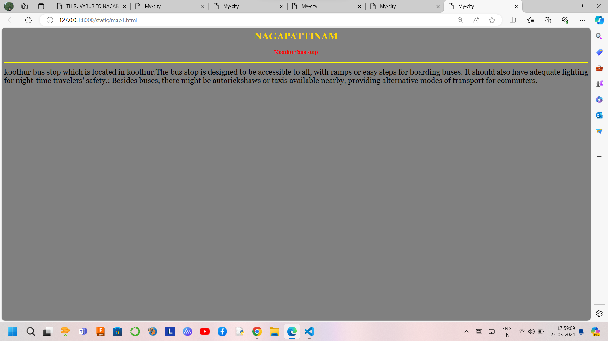
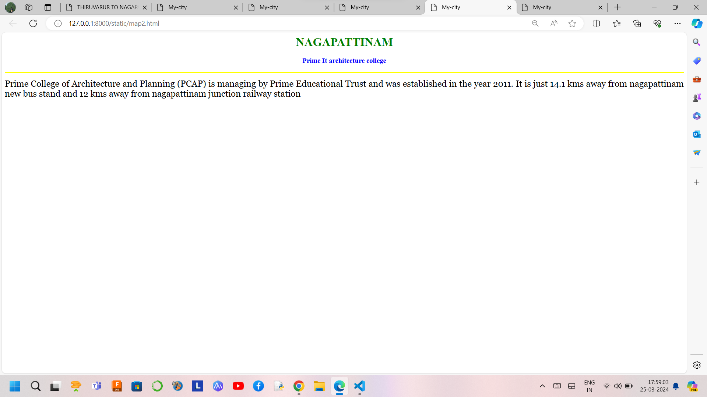
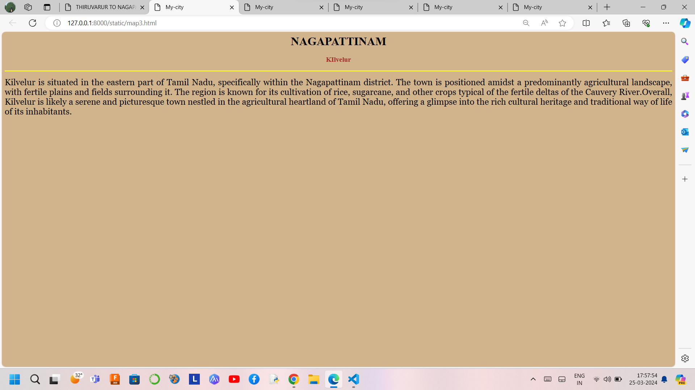
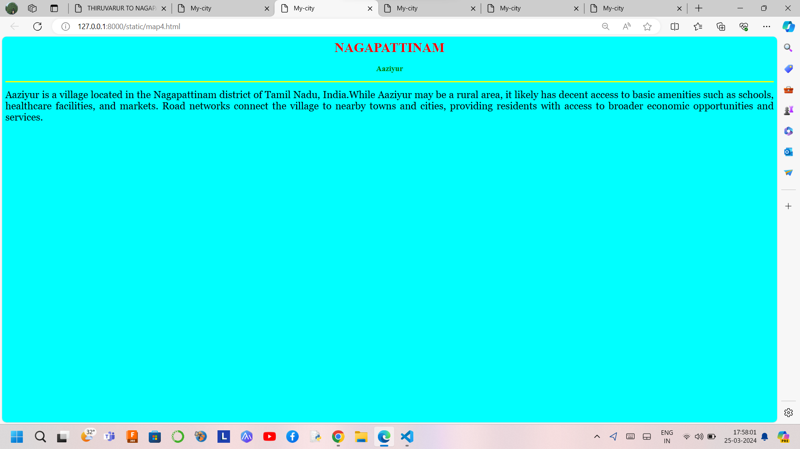
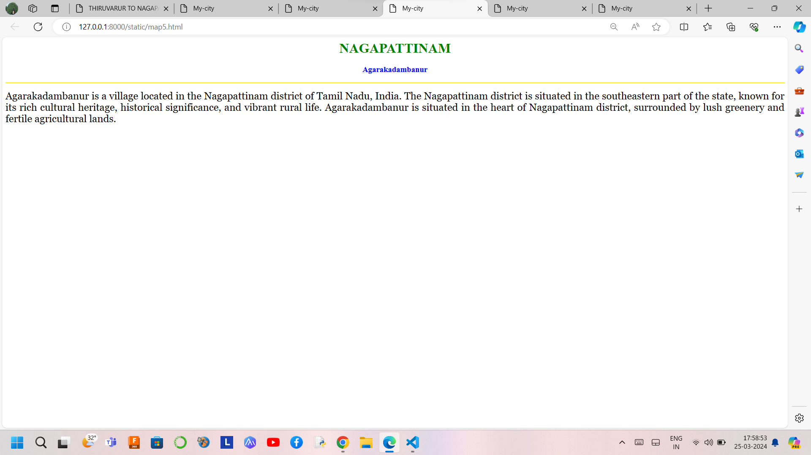

# Ex04 Places Around Me
## Date: 20.03.2024


## AIM
To develop a website to display details about the places around my house.

## DESIGN STEPS

### STEP 1
Create a Django admin interface.

### STEP 2
Download your city map from Google.

### STEP 3
Using ```<map>``` tag name the map.

### STEP 4
Create clickable regions in the image using ```<area>``` tag.

### STEP 5
Write HTML programs for all the regions identified.

### STEP 6
Execute the programs and publish them.

## CODE
```
map.html

<html>
    <head>
        <title>THIRUVARUR TO NAGAPATTINAM</title>
    </head>
    <body bgcolor="LIGHTGREEN">
        <h1>KILVELUR MAP</h1>
        <h3>Susindhar K M (212223040218)</h3>
        
        <map name="image-map">
            <area target="_blank" alt="Koothur bus stop" title="Koothur bus stop" href="map1.html" coords="190,707,406,841" shape="rect">
            <area target="_blank" alt="prime it architecture college" title="prime it architecture college" href="map2.html" coords="792,384,971,492" shape="rect">
            <area target="_blank" alt="KIlvelur" title="KIlvelur" href="map3.html" coords="909,603,89" shape="circle">
            <area target="_blank" alt="Aaziyur" title="Aaziyur" href="map4.html" coords="1532,442,1681,545" shape="rect">
            <area target="_blank" alt="Agarakadambanur" title="Agarakadambanur" href="map5.html" coords="1372,461,105" shape="circle">
</map>

    </body>
</html>
 
 map1.html
  
<html>
    <head>
        <title>My-city</title>
    </head>
    <body bgcolor="grey">
        <h1 align="center">
        <font color="gold"><b>NAGAPATTINAM</b></font>
        </h1>
        <h3 align="center">
        <font color="red"><b>Koothur bus stop</b></font>
        </h3>
        <hr size="3" color="yellow">
        <p align="justify">
        <font face="Georgia" size="5">
            koothur bus stop which is located in koothur.The bus stop is designed to be accessible to all, with ramps or easy steps for boarding buses. It should also have adequate lighting for night-time travelers' safety.: Besides buses, there might be autorickshaws or taxis available nearby, providing alternative modes of transport for commuters.
           
        </font>
        </p>
    </body>
</html>

map2.html

<html>
    <head>
        <title>My-city</title>
    </head>
    <body bgcolor="white">
        <h1 align="center">
        <font color="green"><b>NAGAPATTINAM</b></font>
        </h1>
        <h3 align="center">
        <font color="blue"><b>Prime It architecture college</b></font>
        </h3>
        <hr size="3" color="yellow">
        <p align="justify">
        <font face="Georgia" size="5">
            Prime College of Architecture and Planning (PCAP) is managing by Prime Educational Trust and was established in the year 2011. It is just 14.1 kms away from nagapattinam new bus stand and 12 kms away from nagapattinam junction railway station

        </font>
        </p>
    </body>
</html>

map3.html

<html>
    <head>
        <title>My-city</title>
    </head>
    <body bgcolor="Tan">
        <h1 align="center">
        <font color="black"><b>NAGAPATTINAM</b></font>
        </h1>
        <h3 align="center">
        <font color="brown"><b>KIlvelur</b></font>
        </h3>
        <hr size="3" color="yellow">
        <p align="justify">
        <font face="Georgia" size="5">

             Kilvelur is situated in the eastern part of Tamil Nadu, specifically within the Nagapattinam district. The town is positioned amidst a predominantly agricultural landscape, with fertile plains and fields surrounding it. The region is known for its cultivation of rice, sugarcane, and other crops typical of the fertile deltas of the Cauvery River.Overall, Kilvelur is likely a serene and picturesque town nestled in the agricultural heartland of Tamil Nadu, offering a glimpse into the rich cultural heritage and traditional way of life of its inhabitants.
        </font>
        </p>
    </body>
</html>

map4.html

<html>
    <head>
        <title>My-city</title>
    </head>
    <body bgcolor="cyan">
        <h1 align="center">
        <font color="red"><b>NAGAPATTINAM</b></font>
        </h1>
        <h3 align="center">
        <font color="green"><b>Aaziyur</b></font>
        </h3>
        <hr size="3" color="yellow">
        <p align="justify">
        <font face="Georgia" size="5">
            Aaziyur is a village located in the Nagapattinam district of Tamil Nadu, India.While Aaziyur may be a rural area, it likely has decent access to basic amenities such as schools, healthcare facilities, and markets. Road networks connect the village to nearby towns and cities, providing residents with access to broader economic opportunities and services.


           
        </font>
        </p>
    </body>
</html>

 map5.html

 <html>
    <head>
        <title>My-city</title>
    </head>
    <body bgcolor="white">
        <h1 align="center">
        <font color="green"><b>NAGAPATTINAM</b></font>
        </h1>
        <h3 align="center">
        <font color="blue"><b>Agarakadambanur</b></font>
        </h3>
        <hr size="3" color="yellow">
        <p align="justify">
        <font face="Georgia" size="5">
            Agarakadambanur is a village located in the Nagapattinam district of Tamil Nadu, India. The Nagapattinam district is situated in the southeastern part of the state, known for its rich cultural heritage, historical significance, and vibrant rural life. Agarakadambanur is situated in the heart of Nagapattinam district, surrounded by lush greenery and fertile agricultural lands. 
          

        </font>
        </p>
    </body>
</html>

 ```

## OUTPUT
[text](README.md)
.png>)







## RESULT
The program for implementing image maps using HTML is executed successfully.
